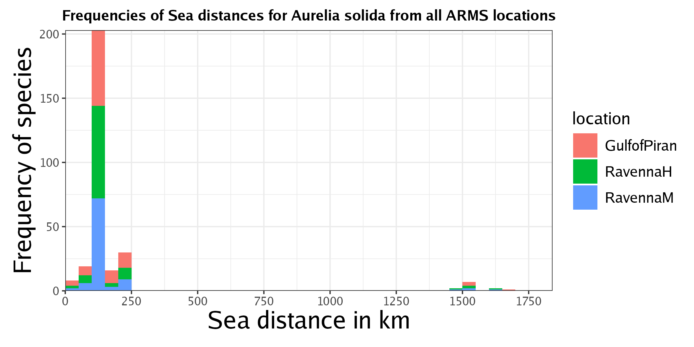
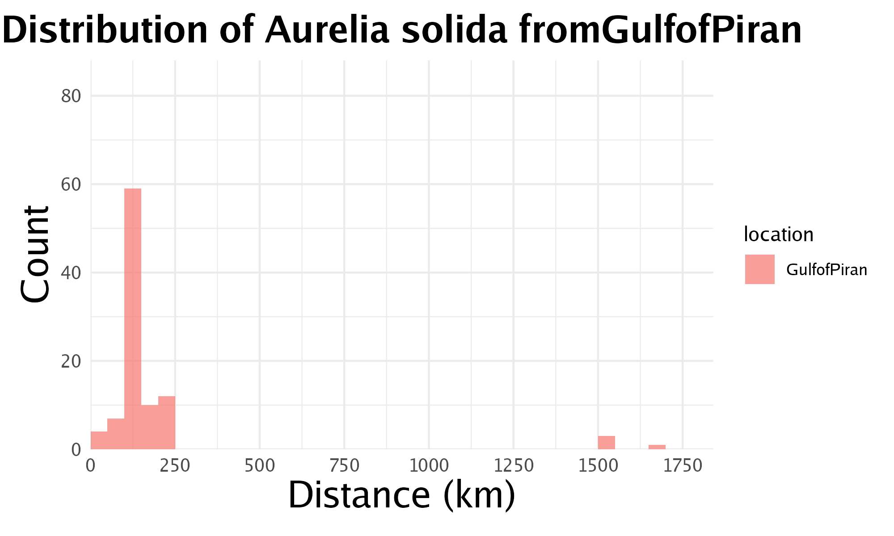
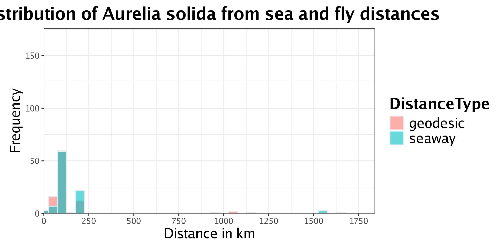
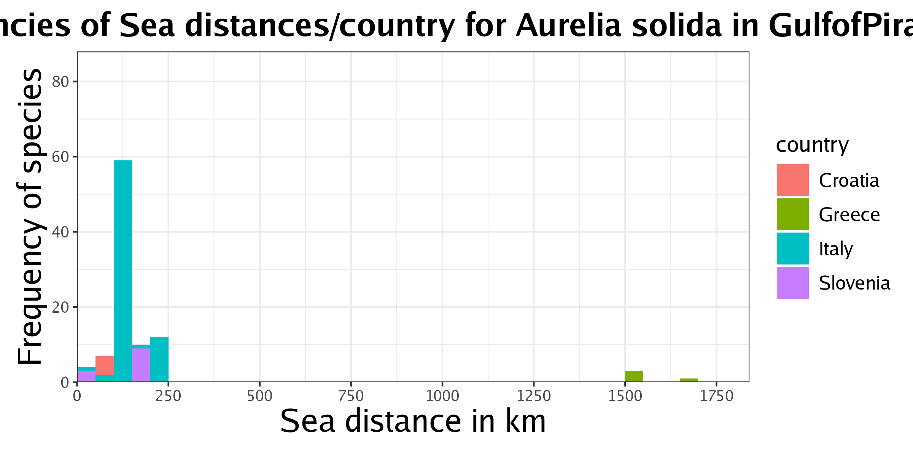
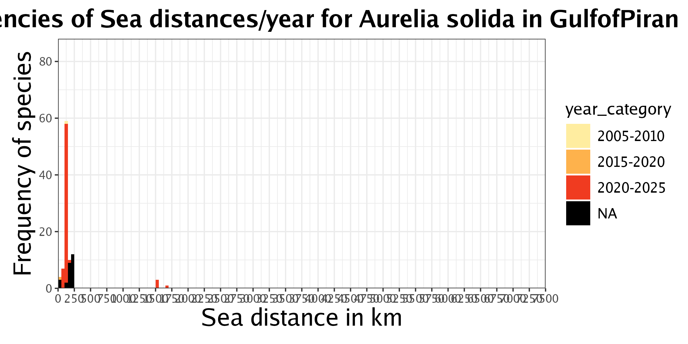

```{r setup, include=FALSE}
knitr::opts_chunk$set(echo = TRUE, eval = FALSE)
```

This document provides an overview of the functions defined in the `functions.R` script. This script supports the main script **`AlienDetective.R`** by defining custom functions.  

The `functions.R` script includes the following functions for the calculations:  

- `fetch_gbif_data()`  
- `is_on_land()`  
- `move_to_sea()`  
- `calculate.distances()`  

The `functions.R` script also contains the following functions for plotting the results:  

- `country.final()`  
- `plot.dist.sea()`  
- `plot.dist.both()`  
- `plot.dist.by.country()`  
- `assign_year_category()`  
- `plot.dist.by.year()`

---  

# Functions for the calculations  

## Function `fetch_gbif_data()`  

The `fetch_gbif_data()` function retrieves occurrence data from GBIF for a specified species.  

### Arguments  

The function allows customization through several arguments:  

- `species`: The scientific name of the species.  
- `hasCoordinate`: If `TRUE`, only return records with coordinates.  
- `continent`: Filters results by continent.  
- `basisOfRecord`: Specifies desired record types.  
- `fields`: Column names to include in the result.  
- `limit`: Maximum number of results to fetch.  
- `output_dir`: Directory where output (if saved) would be stored.  

>**Note:** Refer to the  [`occ_search`](https://docs.ropensci.org/rgbif/reference/occ_search.html) documentation for full details on accepted parameter values.  

### Function Definition

```{r}
fetch_gbif_data <- function(species,
                            hasCoordinate = TRUE,
                            continent = "europe",
                            basisOfRecord = c("OBSERVATION", "MACHINE_OBSERVATION", "HUMAN_OBSERVATION", "MATERIAL_SAMPLE", "LIVING_SPECIMEN", "OCCURRENCE"),
                            fields = c("decimalLatitude", "decimalLongitude", "year", "month", "country"),
                            limit = 10000,
                            output_dir) {
  # Actual code in function (see next blocks)
}
```

>The logic of the function is split into sections to explain each step of the function.  

### Download GBIF Data  

This step uses the parameters above to request occurrence data from the GBIF API via the `rgbif::occ_search()` function.  

```{r}
data_list <- rgbif::occ_search(scientificName = species,
                               hasCoordinate = TRUE,
                               continent = continent,
                               basisOfRecord = basisOfRecord,
                               fields = fields,
                               limit = limit)
```

### Step-by-step logic  

#### Prepare and Combine Records  

We initialize an empty data frame, then iterate over the downloaded records to:  

- Skip empty or missing entries  
- Add missing fields with `NA` to ensure consistent column structure  
- Combine all valid entries into one final data frame (`res`)  

```{r}
# Initialise the empty data frame
res <- data.frame()

# Loop over each data frame in the list
for (i in seq_along(data_list)) {
  # Skip the basis of record(s) that have no data
  if (is.null(data_list[[i]]$data)) {
    next
  } else if (nrow(data_list[[i]]$data) == 0) {
    next
  }
  
  # Replace missing values with "NA"
  missing_columns <- setdiff(fields, colnames(data_list[[i]]$data))
  if (length(missing_columns) > 0) {
    for (col in missing_columns) {
      data_list[[i]]$data[col] <- NA
    }
  }
  
  # Concatenate into 1 data frame
  data_list[[i]]$data$basisOfRecord <- names(data_list)[i]
  res <- rbind(res, data_list[[i]]$data)
}
```

#### Final Formatting and Return  

This step formats the final data frame and filters out incomplete records.  

```{r}
if (nrow(res) > 0) {
  # Reorder columns by order in fields argument
  res <- res[, c(fields, "basisOfRecord")]
  
  # Rename latitude & longitude columns
  colnames(res)[colnames(res) == "decimalLatitude"] <- "latitude"
  colnames(res)[colnames(res) == "decimalLongitude"] <- "longitude"
  
  # Remove occurrences where longitude or latitude is "NA"
  res <- res[!is.na(res$latitude) & !is.na(res$longitude),]
  return(res)
} else {
  error_message <- paste0("No GBIF records found for species \"", species, "\"")
  message(error_message)
  return(NULL)
}
```

---  

## Function `is_on_land()`

The `is_on_land()` function determines whether a given geographical location, defined by latitude and longitude, falls on land or sea, based on the loaded raster map.  

## Arguments  

The function takes 2 arguments, the latitude and longitude of the location.   

>**Note:** The order of the arguments is important, **latitude comes first, followed by longitude**.  

### Function Logic

The function creates a SpatialPoints object using the provided coordinates and the coordinate reference system of the raster map (`r`). It then checks the raster value at that point:  

- If the raster value at that point is `NA`, it is interpreted as land, and the function returns `TRUE`
- Otherwise, the location is considered sea, and the function returns `FALSE`.  

```{r}
is_on_land <- function(lat, lon) {
  point <- sp::SpatialPoints(cbind(lon, lat), proj4string = sp::CRS(proj4string(r)))
  return(is.na(raster::extract(r, point)))
}
```

>**Note:** This function uses the raster object `r` from the global environment, which is defined in `AlienDetective.R`. It is not passed explicitly as an argument.  

---  

## Function `move_to_sea()`  

The `move_to_sea()` function calculates the nearest sea cell to a given location (based on latitude and longitude) within a 100 km range. It returns a named list containing:  

- `coords`: The coordinates of the nearest sea cell.  
- `dist`: The distance to that sea cell (in km).  

If no suitable sea cell is found within the range, the function returns `NULL`.  

### Arguments  

The function takes 2 arguments: the latitude and longitude of the location.  

>**Note:** The order of the arguments is important, **latitude comes first, followed by longitude**.  

```{r}
move_to_sea <- function(lat, lon) {
  # Actual code in function (see next blocks)
}
```

### Step-by-step logic  

#### Identify all sea cells  

The function starts by extracting a transition matrix from the cost raster and identifying all connected (non-barrier) cells. Then it filters these to retain only those that represent sea, which are identified by raster values of `1`.  

```{r}
# Get transition matrix & all connected cells
trans_matrix <- gdistance::transitionMatrix(cost_matrix)
connected_cells <- which(rowSums(trans_matrix != 0) > 0)
connected_coords <- raster::xyFromCell(r, connected_cells)

# Filter to only retain sea cells
is_sea <- raster::extract(r, connected_coords) == 1
sea_coords <- connected_coords[is_sea, , drop = FALSE]

if (nrow(sea_coords) == 0) {
  return(NULL)  # failure signal, no sea cells found
} 
```


#### Search for the nearest sea cell  

The function defines a square search area around the input point, effectively a box approximation of circular search, since distance is converted into degrees (using an approximate conversion of 1 degree ≈ 111 km.  
It starts with a radius of 5 km and increases the search radius in steps of 5 km (up to a maximum of 100 km) until it finds at least one suitable sea cell.  

- If **no sea cells** are found within 100 km, the function returns `NULL`.  
- If **sea cells are found**, it calculates the distance to each one using `distVincentySphere()` from the `geosphere` package.  
The sea cell with the shortest distance is selected and returned.  

>**Note:** The search radius range and step size can be customized by modifying `(seq(5, 100, 5)`, where:  
- the first value is the starting radius,  
- the second value is the maximum radius,  
- and the third value is the step size between attemps.  

```{r}
point_coords <- c(lon, lat)

for (radius_km in seq(5, 100, 5)) {
  radius_deg <- radius_km / 111 # rough conversion km to degrees
  
  # Borders filter box
  lon_min <- lon - radius_deg
  lon_max <- lon + radius_deg
  lat_min <- lat - radius_deg
  lat_max <- lat + radius_deg
  
  # Define sea cells within radius
  sea_in_radius <- which (sea_coords[,1] >= lon_min & sea_coords[,1] <= lon_max &
                          sea_coords[,2] >= lat_min & sea_coords[,2] <= lat_max)
  
  if (length(sea_in_radius) > 0) {
    sea_coords_radius <- sea_coords[sea_in_radius, , drop = FALSE]
    dists <- geosphere::distVincentySphere(point_coords, sea_coords_radius)
    
    # return nearest seapoint
    nearest_idx <- which.min(dists)
    dist <- dists[nearest_idx]
    new_coords <- sea_coords_radius[nearest_idx, , drop = FALSE]
    return(list(
      coords = as.vector(new_coords),
      dist = dist
    ))
  }
  # Otherwise, continues with next larger radius
}
return(NULL) # when no sea point found
```

---  

## Function `calculate.distances()`  

The `calculate.distances()` function is the main distance calculator in the workflow.  
It computes two types of distances between a point from the species_location csv to all GBIF occurrence records for that species:  

- **Sea route distance:** Distance through sea, using a cost distance matrix, contrained to sea cells.  
- **Geodesic distances:** straight line distance (does take curve earth into account).  

### Arguments  

The function takes 5 arguments:  

- `data`: The **data frame** containing the GBIF occurrences.  
- `latitude`: The latitude of the location from the coordinates csv.  
- `longitude`: The longitude of the location from the coordinates csv.  
- `raster_map`: The rasterized map of the world.  
- `cost_matrix`: The cost matrix.  

```{r}
calculate.distances <- function(data, latitude, longitude, raster_map, cost_matrix) {
  # Actual code in function (see next blocks  )
}
```

### Output  

The function returns a named list with three elements:  

- `sea_distances`: Vector of distances (in km) along sea routes.  
- `geodesic distances`: Vector of straight-line distances (in km).  
- `error_messages`: `NULL` if successfull, or an error message string if a failure occurred.  

### Error Handling  

If the input data is missing (`NULL`) or empty, or an error occurs during processing, the function handles it using `tryCatch()` and returns an appropriate message in `error_messages`.  

### Step-by-step logic  

#### Initial checks  

The function first checks if the `data` is valid. If it's `NULL` or empty, it returns early with appropriate messages.  

```{r}
if (is.null(data)) return(list(sea_distances = NULL, geodesic_distances = NULL, error_messages = "Input table is NULL"))
if (nrow(data) < 1) return(list(sea_distances = NULL, geodesic_distances = NULL, error_messages = "Input table is has no entries"))
```

#### Prepare coordinates  

Creates `SpatialPoints` for the observation from the coordinates csv and the GBIF points (using possibly moved coordinates if available).  

```{r}
tryCatch({
  # Specify the PROJ4 string for WGS84
  proj4_crs <- sp::CRS("+init=EPSG:4326")
  
  # Create SpatialPoints objects from the coordinates
  query_point <- sp::SpatialPoints(cbind(longitude, latitude), proj4string = proj4_crs)
  ref_points <- sp::SpatialPoints(cbind(ifelse(is.na(data$longitude_moved), data$longitude, data$longitude_moved),
                                        ifelse(is.na(data$latitude_moved), data$latitude, data$latitude_moved)),
                                  proj4string = proj4_crs)

  # ...
})
```

#### Filter points in the sea  

Using the raster map, the function identifies which GBIF points are at sea (`raster value == 1`). These are the only ones considered for sea distance calculations. Result vectors for both sea distance and geodesic distance are initialized.  

```{r}
tryCatch({
  # ...
  
  cell_values <- raster::extract(raster_map, ref_points)
  indexes <- which(cell_values == 1L)
  
  # Initialize result vectors
  sea_distances <- rep(NA_real_, length(cell_values))
  geodesic_distances <- rep(NA_real_, length(cell_values))
  
  # ...
})
```

#### Distance calculations  

Both of the distances are only calculated when a point at sea has been found.  

- **Sea route distance:** Uses the `costDistance()` function from the `gdistance` package.  
- **Geodesic distance:** Uses the function `geodist()` from the `geodist` package.  

Both distances are rounded and converted to kilometers.

```{r}
tryCatch({
  # ...
  
  if (length(indexes) > 0) {
    # Subset points that are in the sea
    ref_points_sea <- ref_points[indexes,]
    # Vectorized sea distance calculation to all GBIF occurrences in the sea
    sea_distances[indexes] <- as.numeric(gdistance::costDistance(cost_matrix, query_point, ref_points_sea)[1,])
    # Convert points to simple table format for use with geodist
    query_point_table <- data.frame(lon = sp::coordinates(query_point)[,1],
                                    lat = sp::coordinates(query_point)[,2])
    ref_points_sea_table <- data.frame(lon = sp::coordinates(ref_points_sea)[,1],
                                       lat = sp::coordinates(ref_points_sea)[,2])
    # Vectorized geodesic distance calculation to all GBIF occurrences in the sea
    geodesic_distances[indexes] <- as.numeric(geodist::geodist(query_point_table, ref_points_sea_table, measure = "geodesic"))
    # Convert distances to kilometres
    sea_distances <- round(sea_distances / 1000, 0)
    geodesic_distances <- round(geodesic_distances / 1000, 0)
  }
  
  # ...
})
```

#### Return result  

Returns a list with the calculated vectors. If an error occurs, a descriptive error message is returned instead. 

```{r}
tryCatch({
  # ...
  
  return(list(sea_distances = sea_distances, geodesic_distances = geodesic_distances, error_messages = NULL))
}, error = function(e) {
  error_messages <- paste0("An error occurred during distance calculation for ", species, " in ", location, ": ", e$message)
  return(list(sea_distances = NULL, geodesic_distances = NULL, error_messages = error_messages))
})
```

---  

# Plotting functions  

## Function that that shows distribution of one species at all GBIF location starting from ARMS location  

First plot that is created uses a species name, the distances from one ARMS location to all GBIF locations and the output graph is put in a directory.The graph shows the distribution in a percentage against the total amount of occurrences. The x-axis is the distance in km.  
**Goal of this graph:** View a possible pattern of movement for one species.  

```{r}
country.final <- function(species, distances, output_dir) {
  max_x <- max(long_sea$x) #Put the maximum distance in a variable to use for the x-axis limit
  plot <- ggplot(long_sea, aes(x = x, fill = location)) +
    geom_histogram(aes(y = after_stat(count / sum(count) * 100)), # makes sure the y-axis changes from frequency to percentage
                   binwidth = 50, #set the bar width
                   boundary = 0, #Control bin alignment
                   position = "stack") + #how overlapping data is positione 
    labs(title = paste0("Frequencies of Sea distances for ", species," from all ARMS locations" ),
         x = "Sea distance (km)", y = "Percentage of total occurrences (%)") + #Set the axis labels 
    theme_bw() +
    #scale_fill_brewer(palette = "Set1") +  # You can choose a different palette if you like
    theme(plot.title = element_text(hjust = 0.5, size = 13, face = "bold"), # set title font size, placement
          plot.margin = margin(0.3, 0.3, 0.4, 0.4, "cm"), #Set margins for plot
          axis.text = element_text(size = 10),           # Set font size for axis numbers
          axis.title = element_text(size = 12), # Set axis titles size
          legend.title = element_text(size = 13),   # Increase legend title size
          legend.text = element_text(size = 10),    # Increase legend text size
          legend.key.size = unit(1, "lines"), # Sets the size of the symbol next to the legend text
          axis.text.x = element_text(angle = 45, hjust = 1)) +  # Sets angle of x-axis text 
    scale_x_continuous(breaks = seq(0, max_x*1.1, by = 500), expand = c(0, 0))+ #sets the behaviour of x-axis
    scale_y_continuous(expand = c(0, 0)) + #sets behaviour for y axis
    coord_cartesian(xlim = c(0, max_x*1.1), ylim = c(0,20)) # Use coord_cartesian for setting limits
  
  if(!dir.exists(output_dir)) {
    dir.create(output_dir, recursive = TRUE) #Create output directory if doesn't exist
  }
  ggsave(filename = file.path(output_dir, paste0(gsub(" ", "_", species), "_from_all_ARMS_locations", ".png")), 
         plot = plot, width = 2400, height = 1200, units = "px", dpi = 300) #add plot into right directory
  return(plot)
}
```

**Example:**  

  

## Function for graph of sea distances  

This function takes the same arguments as the graph before but also a location needs to be provided. This graphs consist of one species that is present in a certain ARMS location and the distance to a certain GBIF location.  
**Goal of graph:** See the distribution of one species from one ARMS location to another location in GBIF.  

```{r}
plot.dist.sea <- function(species, location, distances, output_dir) {
  max_x <- max(sea_loc_data$x)
  # make histograms of distances per species, with filtering on distance limit 40000
  plot <- ggplot(sea_loc_data, aes(x = x, fill = location)) +
    geom_histogram(aes(y = after_stat(count / sum(count) * 100)), 
                   binwidth = 50,
                   boundary = 0,
                   position = "stack",
                   alpha = 0.7 ) +  # Transparency level
    labs(title = paste0("Distribution of ", species, " from ", loc), x = "Sea distance (km)", y = "Percentage of total occurrences (%)") +
    theme_minimal()+
    #scale_fill_brewer(palette = "Set1") +
    theme(plot.title = element_text(hjust = 0.5, size = 15, face = "bold"), 
          plot.margin = margin(0.3, 0.3, 0.4, 0.4, "cm"),
          axis.text = element_text(size = 10),           
          axis.title = element_text(size = 12),
          axis.text.x = element_text(angle = 45, hjust = 1)) +         
    scale_x_continuous(breaks = seq(0, max_x*1.1, by = 500), expand = c(0, 0)) +
    scale_y_continuous(expand = c(0, 0)) +
    coord_cartesian(xlim = c(0, max_x*1.1), ylim = c(0,100))
  
  
  if(!dir.exists(output_dir)) {
    dir.create(output_dir, recursive = TRUE)
  }
  ggsave(filename = file.path(output_dir, paste0(gsub(" ", "_", species), "_from_", location, ".png")), 
         plot = plot, width = 2000, height = 1200, units = "px", dpi = 300)
  return(plot)
}
```

**Example:**  

  

## Function for seaway and geodesic graphs  

This function takes the same arguments as the last graph but now it uses a different data frame where seaway and geodesic data is combined. Each distance type is colored in another color.  
**Goal of the graph:** See the distribution of seaway and geodesic distances for one species at one ARMS location.  

```{r}
# Make combined histogram of sea distances and fly distances
plot.dist.both <- function(species, location, distances, output_dir) {
  combined_distances <- rbind(sea_loc_data, geo_loc_data)
  max_x <- max(sea_loc_data$x)
  plot <- ggplot(combined_distances, aes(x = x, fill = DistanceType)) +
    geom_histogram(aes(y = after_stat(count / sum(count) * 100)),
                   binwidth = 50,
                   color="#e9ecef", #edges of the bars
                   alpha=0.6,
                   position = 'identity') + # Place all the bars exactly where they exactly fall on x-axis
    theme_bw() +
    ggtitle(paste0("Distribution of ", species," from sea and fly distances")) +
    theme(
      plot.title = element_text(hjust = 0.5, size = 12, face = "bold"), # set title font size, placement
      plot.margin = margin(0.3, 0.3, 0.4, 0.4, "cm"),
      axis.text = element_text(size = 10),  # Set font size for axis numbers
      axis.title = element_text(size = 12), # Set font size for title
      legend.title = element_text(size = 13, face="bold"), # Settings for legend title
      legend.text = element_text(size = 10),
      axis.text.x = element_text(angle = 45, hjust = 1)) +  # settings for legend text
    scale_x_continuous(breaks = seq(0, max_x*1.1, by = 500), expand = c(0, 0)) +  # settings for x axis
    scale_y_continuous(expand = c(0, 0)) +
    # used expand to make sure the axes are on the lines of the axes and not above them floating
    coord_cartesian(xlim = c(0, max_x*1.1), ylim = c(0,100)) + # Use coord_cartesian for setting limits
    # set legend title and labels
    labs(x = "Sea distance (km)", y = "Percentage of total occurrences (%)", fill = "DistanceType")
  
  if(!dir.exists(output_dir)) {
    dir.create(output_dir, recursive = TRUE)
  }
  ggsave(filename = file.path(output_dir, paste0(gsub(" ", "_", species), "_from_", location, "_seadist&geodesic.png")), 
         plot = plot, width = 2400, height = 1200, units = "px", dpi = 300)
  return(plot)
}
```

**Example:**  

  

## Function for distrubtion of species coloured by country  

This function is the same as the previous one but colors based on GBIF countries.  
**Goal of the graph:** Show distribution of one species at one ARMS location to other GBIF locations (countries) colored in a seperate color for each GBIF location.  

```{r}
plot.dist.by.country <- function(species, location, distances, output_dir) {
  max_x <- max(sea_loc_data$x)
  plot <- ggplot(sea_loc_data, aes(x = x, fill = country)) +
    geom_histogram(aes(y = after_stat(count / sum(count) * 100)),
                   binwidth = 50,
                   boundary = 0,
                   position = "stack") +  
    labs(title = paste0("Frequencies of Sea distances/country for ", species," in ", location),
         x = "Sea distance (km)", y = "Percentage of total occurrences (%)") +
    theme_bw() +
    #scale_fill_brewer(palette = "Set1") +  
    theme(plot.title = element_text(hjust = 0.5, size = 12, face = "bold"), 
          plot.margin = margin(0.3, 0.3, 0.4, 0.4, "cm"),
          axis.text = element_text(size = 10),           
          axis.title = element_text(size = 12),
          legend.title = element_text(size = 14), 
          legend.text = element_text(size = 12),
          legend.key.size = unit(1.5, "lines"),
          axis.text.x = element_text(angle = 45, hjust = 1)) +  
    scale_x_continuous(breaks = seq(0, max_x*1.1, by = 500), expand = c(0, 0)) +
    scale_y_continuous(expand = c(0, 0)) +
    coord_cartesian(xlim = c(0, max_x*1.1), ylim = c(0,100)) 
  
  if(!dir.exists(output_dir)) {
    dir.create(output_dir, recursive = TRUE)
  }
  ggsave(filename = file.path(output_dir, paste0(gsub(" ", "_", species), "_from_", location, "_by_country.png")), 
         plot = plot, width = 2400, height = 1200, units = "px", dpi = 300)
  return(plot)
}
```

**Example:**  

  

## Function for graph coloured based on occurence year  

### First check if year falls into categories  

```{r}
assign_year_category <- function(year) {
  if (is.na(year)) {
    return(NA)   # return NA when year is not present
  }
  for (category in year_categories) {
    range <- as.numeric(unlist(strsplit(category, "-"))) # save years as numeric without "-"
    if (year >= range[1] & year < range[2]) {  # if the year falls into this category
      return(category) # return this category
    }
  }
  return(NA) # If year doesn't fall into any category, return NA
}
```

### Plot function  

Takes the same arguments as the other graphs but colors on the year of occurrence.  

```{r}
plot.dist.by.year <- function(species, location, distances, output_dir) {
  plot <- ggplot(sea_loc_data, aes(x = x, fill = year_category)) +
    geom_histogram(aes(y = after_stat(count / sum(count) * 100)),binwidth = 50, boundary = 0, position = "stack") +  # adjust the binwidth to personal preference
    labs(title = paste0("Frequencies of Sea distances/year for ", species," in ", location),
         x = "Sea distance (km)", y = "Percentage of total occurrences (%)") +
    theme_bw() +
    scale_fill_brewer(palette = "YlOrRd", na.value = "black") + # You can choose a different palette if you like
    theme(plot.title = element_text(hjust = 0.5, size = 15, face = "bold"), 
          plot.margin = margin(0.3, 0.3, 0.4, 0.4, "cm"),
          axis.text = element_text(size = 10),           
          axis.title = element_text(size = 12),
          legend.title = element_text(size = 10),   
          legend.text = element_text(size = 8),    
          legend.key.size = unit(1.5, "lines"),
          axis.text.x = element_text(angle = 45, hjust = 1)) +   
    scale_x_continuous(breaks = seq(0, 7500, by = 500), expand = c(0, 0)) +
    scale_y_continuous(expand = c(0, 0)) +
    coord_cartesian(xlim = c(0, 7500), ylim = c(0,100)) 
  
  if(!dir.exists(output_dir)) {
    dir.create(output_dir, recursive = TRUE)
  }
  ggsave(filename = file.path(output_dir, paste0(gsub(" ", "_", species), "_from_", location, "_by_year.png")), 
         plot = plot, width = 2400, height = 1200, units = "px", dpi = 300)
  return(plot)
}
```

**Example:**  



## Summary
All goals of these graphs is to see a certain pattern of how a species behave in terms of movement and where is comes from. This can than be used to give a certain label to a species.  

--- 

